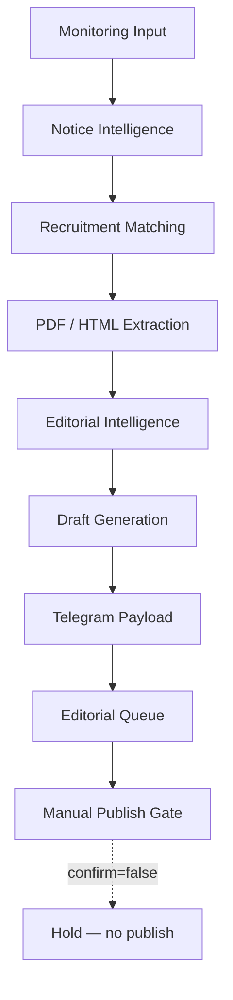
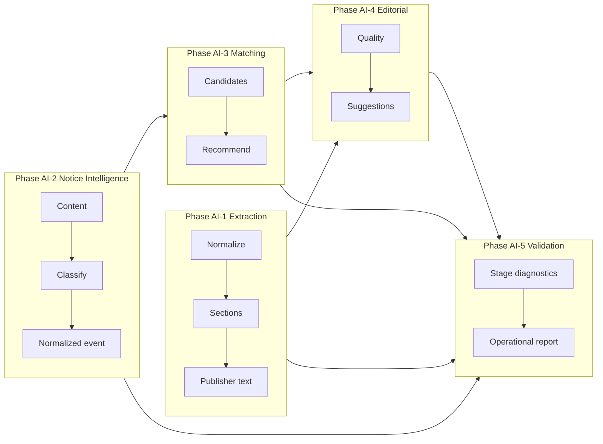

# Phase AI-5 — End-to-End Production Validation & Operational Readiness

## 1. Objective

Validate the complete automation pipeline against representative real-world
government recruitment scenarios **without changing production behaviour**.

This phase performs validation, diagnostics, reporting, and operational readiness
checks only. It does **not** modify Production Workflow, Generator UI, Monitoring,
scheduler behaviour, deployment configuration, or database schema. It does **not**
enable `AUTO_PUBLISH`, does **not** publish pages, and does **not** activate the
scheduler.

Every output carries `advisoryOnly: true` and `appliesChanges: false`.

### Validated flow

```
Monitoring Input
      ↓
Notice Intelligence          (Phase AI-2)
      ↓
Recruitment Matching         (Phase AI-3)
      ↓
PDF / HTML Extraction        (Phase AI-1)
      ↓
Editorial Intelligence       (Phase AI-4)
      ↓
Draft Generation             (advisory package)
      ↓
Telegram Payload             (format only — no delivery)
      ↓
Editorial Queue              (package inspect — no reviewAction)
      ↓
Manual Publish Gate          (confirm=false — no publish)
```

## 2. Architecture notes

### New module: `server/lib/pipelineValidation/`

| File | Responsibility |
| --- | --- |
| `types.js` | Stage IDs, scenario/failure kinds, health & readiness vocabularies |
| `diagnostics.js` | Per-stage diagnostic builder (input/output/result/warnings/confidence/duration/memory) |
| `performance.js` | Extraction / classification / matching / editorial / total latency + bottlenecks |
| `pipelineRunner.js` | End-to-end orchestration of AI-1…AI-4 + Telegram / Queue / Publish Gate inspect |
| `suite.js` | Representative scenario suite + failure simulation suite |
| `compatibility.js` | Read-only backward-compatibility / flag / policy checks |
| `readiness.js` | Reliability, stability, isolation, review readiness, recovery scoring |
| `report.js` | Aggregate operational report + scenario output digest |
| `diagrams.js` | ASCII + Mermaid pipeline diagrams |
| `index.js` | Public facade + `runFullValidation()` |

### Reuse rather than duplication

- Notice Intelligence, Recruitment Matching, Generator Intelligence, and Editorial
  Intelligence are **required read-only** — none of their source files are modified.
- Telegram formatting uses Package TG-1 `formatTelegramMessage` (no delivery).
- Editorial Queue uses `buildEditorialPackage` for inspection only (no `reviewAction`).
- Manual Publish Gate uses `evaluateManualPublishGate({ confirmManualPublish: false })`.
- Automation flags and publishing policy are asserted, never mutated.

### Files created

```
server/lib/pipelineValidation/                  (10 files)
tests/phaseAI5.pipelineValidation.test.js       (36 tests)
tests/fixtures/ai5/scenarios.js                 (15 scenarios + 11 failures)
docs/ai5-end-to-end-production-validation-report.md
docs/samples/ai5-scenario-outputs.json
```

### Files modified

**None.** No existing Production Workflow, Generator UI, Monitoring, config,
migration, or deployment file was changed by this phase. The module is reachable
only by explicitly requiring `server/lib/pipelineValidation`.

## 3. Real scenario test suite

| # | Scenario | Fixture source | Expected family |
| --- | --- | --- | --- |
| 1 | New Recruitment | AI-2 UPPSC | `new_recruitment` |
| 2 | Recruitment Update | AI-3 Apply Online | `apply_online` |
| 3 | Admit Card | AI-2 SSC | `admit_card` |
| 4 | Result | AI-2 RRB | `result` |
| 5 | Answer Key | AI-3 UPPSC | `answer_key` |
| 6 | Correction | AI-2 NTA | `correction` |
| 7 | Corrigendum | AI-2 DSSSB | `corrigendum` |
| 8 | Extension | AI-2 BPSC | `extension_notice` |
| 9 | Exam Date | AI-3 SSC | `exam_date` |
| 10 | Exam City | AI-2 NTA | `exam_city` |
| 11 | Final Result | AI-2 UP Police | `final_result` |
| 12 | DV Schedule | AI-3 RRB | `dv_schedule` |
| 13 | Scholarship | AI-5 NSP | `scholarship` |
| 14 | Admission | AI-5 DU | `admission` |
| 15 | Apprentice | AI-2 RRB | `apprentice` |

**Measured (fixture run):** scenario success rate **1.0** (15/15 completed without
hard stage failure); editorial quality high band on 13/15; recommendation mix
includes `UPDATE_EXISTING`, `CREATE_NEW`, `POSSIBLE_DUPLICATE`, `IGNORE`.

## 4. Failure simulation

| Failure | Expected signal (observed) |
| --- | --- |
| Missing PDF | `EMPTY_PDF_TEXT` / `MISSING_EXTRACTION_TEXT` |
| Broken PDF | `BROKEN_PDF_ARTIFACTS` + low extraction quality |
| OCR-heavy PDF | extraction / language warnings |
| Incomplete HTML | `INCOMPLETE_HTML` |
| Duplicate notice | `DUPLICATE_FINGERPRINT` |
| Unknown organization | unknown / low-confidence classification |
| Conflicting advertisement number | validation / consistency warnings |
| Conflicting dates | cross-section / date warnings |
| Missing links | editorial / link gaps |
| Low confidence classification | `LOW_CLASSIFICATION_CONFIDENCE` |
| Ambiguous recruitment match | `AMBIGUOUS_MATCH` / `MANUAL_REVIEW_RECOMMENDED` |

Failure isolation: warnings localize to affected stages; no silent abort of the
full advisory pipeline.

## 5. Stage diagnostics

Every stage emits:

- Input (bounded summary)
- Output (stage-specific summary)
- Execution result (`pass` / `warn` / `fail` / `error` / `skip`)
- Warnings
- Confidence (`score`, `level`)
- Validation issues
- Duration (ms)
- Memory delta (heap bytes, where practical)

## 6. Performance measurements

Representative aggregate (26 runs = 15 scenarios + 11 failures, Node local):

| Metric | Average |
| --- | --- |
| Extraction time | ~0.9 ms |
| Classification time (AI-2) | ~35 ms |
| Matching time (AI-3) | ~1.7 ms |
| Editorial analysis (AI-4) | ~1.2 ms |
| **Total pipeline latency** | **~39 ms** |

**Bottleneck:** Notice Intelligence (classification) dominates latency — expected,
because it performs content analysis, heading detection, department/reference
extraction, and event classification. Matching and editorial passes are cheap on
fixture-sized inputs.

Peak observed heap delta across stages is on the order of ~10–15 MB for the
largest HTML/PDF-text fixtures (approximate; not a production SLO).

## 7. Operational readiness

| Dimension | Assessment |
| --- | --- |
| Reliability | High — scenario suite completes without hard fails |
| Stability | High — failure sims continue with diagnostics |
| Backward compatibility | Pass — all flag/policy checks green |
| Failure isolation | High — warnings localized per stage |
| Manual review readiness | High — ambiguous / low-confidence / duplicate cases surface review codes |
| Recovery behaviour | High — pipeline produces diagnostics instead of silent abort |

**Verdict:** `ready_with_manual_review`  
**Health:** `healthy`  
**Publishing denied:** yes  
**AUTO_PUBLISH:** remains `false`  
**Scheduler:** inactive  

## 8. Operational report contents

`buildOperationalReport()` / `runFullValidation()` produce:

- Pipeline health (per-stage pass/warn/fail rates + avg duration)
- Success rate
- Failure categories
- Confidence distribution
- Recommendation quality
- Editorial quality distribution
- Performance summary
- Known limitations
- Recommended future improvements
- Production readiness assessment
- Mermaid + ASCII diagrams

Machine-readable digest: [`docs/samples/ai5-scenario-outputs.json`](./samples/ai5-scenario-outputs.json).

## 9. Backward compatibility

| Check | Result |
| --- | --- |
| No Production Workflow behaviour change | Met — identical status/finalState/publish flags with vs without additive enrichment; AI-5 validation is side-channel only |
| No scheduler activation | Met — `SCHEDULER_ACTIVATION_ENABLED=false`, `canStartMonitoringScheduler()=false` |
| No Generator UI / pipeline shape change | Met — Generator Intelligence output identical before/after AI-5 require |
| No database schema changes | Met — none introduced |
| `AUTO_PUBLISH` remains false | Met — flags + `PUBLISHING_POLICY` |
| Telegram delivery not enabled | Met |
| Live crawler / production monitoring dormant | Met |

## 10. Pipeline diagrams

### ASCII

```
Monitoring Input
      ↓
Notice Intelligence
      ↓
Recruitment Matching
      ↓
PDF / HTML Extraction
      ↓
Editorial Intelligence
      ↓
Draft Generation
      ↓
Telegram Payload
      ↓
Editorial Queue
      ↓
Manual Publish Gate

(AI-5 validates each stage; does not publish / schedule / auto-publish)
```

### Mermaid (end-to-end)



### Mermaid (intelligence layers)



## 11. Known limitations

1. Validation uses text/HTML fixtures only — no live government website fetches.
2. Binary PDF bytes are not stored; broken/missing PDF cases use synthetic `pdfText`.
3. Telegram stage formats payloads only; delivery transports are never invoked.
4. Editorial Queue builds packages for inspection; `reviewAction` transitions are not applied.
5. Manual Publish Gate is evaluated with `confirm=false`; publishing engine is never called.
6. Memory measurements reflect Node heap deltas and are approximate.
7. Scholarship / Admission scenarios may classify with lower confidence than core recruitment types.
8. AI-5 does not modify Production Workflow orchestration order or stage runners.

## 12. Recommended future improvements

1. Golden-file regression snapshots per scenario for confidence drift detection.
2. Optional dry-run hooks into Monitoring Bot without enabling `LIVE_CRAWLER`.
3. Extend OCR-heavy fixtures with licensed real scanned-PDF text samples.
4. Surface AI-5 diagnostics in a read-only operator dashboard.
5. Tune ambiguous-match separation thresholds on a larger recruitment corpus.
6. Per-board precision/recall reports once a labeled evaluation set exists.
7. Optional parallel timing for extraction vs classification when inputs allow.

## 13. Test evidence

| Suite | Result |
| --- | --- |
| `tests/phaseAI5.pipelineValidation.test.js` | **36 passed** |
| Phase AI-1 + AI-2 + AI-3 + AI-4 (regression) | **263 passed** |

## 14. Success criteria

| Criterion | Status |
| --- | --- |
| Complete automation pipeline validated | Met |
| Operational readiness documented | Met |
| Bottlenecks identified | Met (Notice Intelligence dominates latency) |
| Future tuning opportunities documented | Met |
| Existing production behaviour unchanged | Met |
| No publishing / no scheduler / `AUTO_PUBLISH` false | Met |

## 15. How to re-run

```bash
# Unit / integration validation
npx jest tests/phaseAI5.pipelineValidation.test.js --runInBand

# Programmatic full report
node -e "const { runFullValidation } = require('./server/lib/pipelineValidation'); const { listScenarios, listFailures } = require('./tests/fixtures/ai5/scenarios'); console.log(JSON.stringify(runFullValidation({ scenarios: listScenarios(), failures: listFailures() }).operationalReport.productionReadinessAssessment, null, 2));"
```
