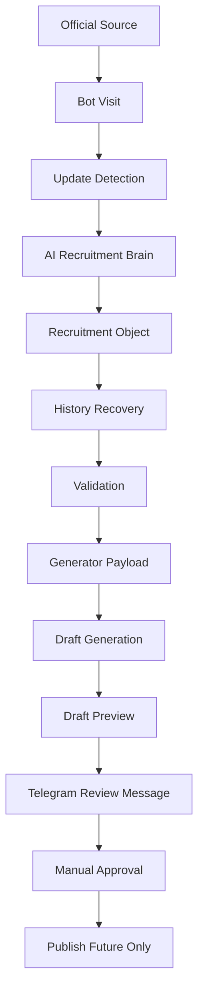

# AMP-2 Automation Workflow Report

## Implementation Report

AMP-2 delivers a cohesive advisory-only automation workflow layer for Sarkari Suchna India. The package orchestrates `Bot -> AI -> Draft -> Telegram Review` using the existing AMP-1 Recruitment Intelligence Brain as the intelligence layer and Package `5D` as the draft preparation foundation. The implementation is production-ready in structure, but production-disabled by policy and by runtime effects.

`RECRUITMENT_PIPELINE_ENABLED` remains fail-safe `false`.

## Architecture Summary

- `AMP-1` remains the intelligence layer and produces the canonical `Recruitment Object`.
- `AMP-2` adds the orchestration layer that converts intelligence output into review-ready workflow artifacts.
- `AMP-2` reuses draft preparation, review queue, and Telegram notification package identities without activating persistence or delivery.
- All runtime effects remain advisory-only: no publishing, no scheduler, no worker, no cron, no route changes, no live crawling.

## Workflow Diagram

## Created Files

- `server/lib/project/automationWorkflow/workflowModules.js`
- `server/lib/project/automationWorkflow/automationWorkflowOrchestrator.js`
- `server/lib/project/program5/packageAMP2AutomationWorkflowFramework.js`
- `sarkari-suchna-india/server/lib/recruitment/automationWorkflow/index.js`
- `sarkari-suchna-india/server/lib/recruitment/workPackages/WP_AUTOMATION_WORKFLOW.js`
- `sarkari-suchna-india/tests/packageAMP2.unit.test.js`
- `sarkari-suchna-india/tests/packageAMP2.integration.test.js`
- `sarkari-suchna-india/docs/amp2-automation-workflow-report.md`

## Modified Files

- None beyond the new AMP-2 package files.

## Test Results

- Unit coverage added for:
  - workflow orchestration
  - state machine
  - draft package builder
  - difference engine
  - approval workflow
  - review queue
  - audit logging
  - metrics
  - failure recovery
  - versioning
  - safety invariants
- Integration coverage added for:
  - no new route activation
  - no admin nav exposure
  - fail-safe pipeline flag behavior
  - advisory work package registration

## Future Integration Notes

- Wire AMP-2 outputs into AMP-3 Admin UI as read-only review artifacts first.
- Keep review queue persistence behind a separate explicit authorization package.
- Keep Telegram transport disconnected until manual review operations and credentials governance are approved.
- Map `Approved` to a future publish package only after explicit authorization.
