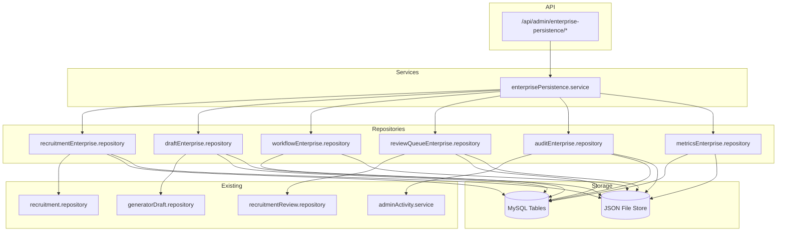
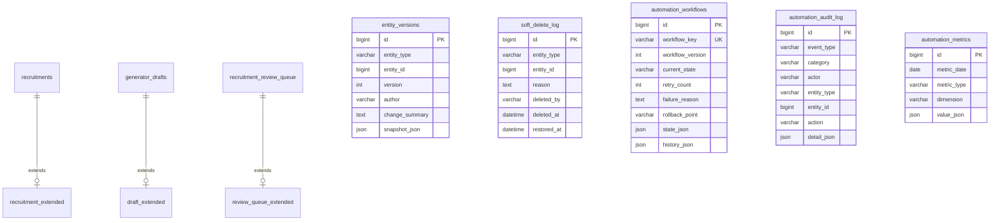

# AMP-4A.2 Enterprise Persistence Layer — Implementation Report

**Package:** AMP-4A.2  
**Title:** Enterprise Persistence Layer & Production Integration Completion  
**Status:** Complete — AMP-4A fully delivered  
**Automation State:** Dormant (all execution gates OFF)

---

## Executive Summary

AMP-4A.2 completes the Automation Maturity Program Phase 4A by delivering enterprise-grade repositories, persistence infrastructure, auditability, version history, review storage, workflow persistence, RBAC foundation, notification gateway abstraction, universal search, and soft-delete framework — while keeping every automation execution path disabled.

**RECRUITMENT_PIPELINE_ENABLED remains `false`.**  
**AUTO_DRAFT_ENABLED, AUTO_PUBLISH_ENABLED, LIVE_CRAWLER_ENABLED, TELEGRAM_DELIVERY_ENABLED, NOTIFICATION_GATEWAY_ENABLED** — all remain `false`.

---

## Architecture Summary

### Layered Design

```
Admin API (JWT + CSRF)
        │
        ▼
Enterprise Persistence Controller
        │
        ▼
Enterprise Persistence Service (DI facade)
        │
   ┌────┴────┬──────────┬──────────┬──────────┐
   ▼         ▼          ▼          ▼          ▼
Recruitment Draft   Workflow  Review    Audit/Metrics
Enterprise  Enterprise Enterprise Queue     Repos
Repository  Repository Repository Enterprise
   │         │          │          │          │
   └────┬────┴──────────┴──────────┴──────────┘
        ▼
Shared Base Infrastructure
(pagination, filters, search, schema guard,
 optimistic lock, transactions, file-store fallback)
        │
   ┌────┴────┐
   ▼         ▼
MySQL      JSON File Store
(migration   (schema-adaptive
 optional)    fallback)
```

### Repository Pattern

- **BaseRepository** — shared SQL helpers, pagination, JSON parsing
- **Enterprise repositories** — domain-specific persistence with SQL + file fallback
- **Service facade** — dependency injection via `createEnterprisePersistenceService()`
- **Schema-adaptive** — detects table existence; operates without migration applied

### Cross-Cutting Frameworks

| Framework | Location | Purpose |
|-----------|----------|---------|
| Version History | `server/lib/enterprise/versionHistory/` | Version, restore, compare, author, timestamp |
| Soft Delete | `server/lib/enterprise/softDelete/` | Delete, restore, permanent delete, audit |
| Universal Search | `server/lib/enterprise/search/` | Cross-entity search with pagination |
| RBAC | `server/lib/enterprise/rbac/` | Role matrix (no runtime enforcement change) |
| Notification Gateway | `server/lib/enterprise/notificationGateway/` | Channel abstraction (all disabled) |
| Cache Interface | `server/lib/enterprise/cache/` | Future Redis-compatible interface |

---

## Repository Diagram



---

## Database Diagram



---

## Created Files

### Base Infrastructure
- `server/lib/enterprise/base/pagination.js`
- `server/lib/enterprise/base/filterBuilder.js`
- `server/lib/enterprise/base/searchBuilder.js`
- `server/lib/enterprise/base/validators.js`
- `server/lib/enterprise/base/jsonColumn.js`
- `server/lib/enterprise/base/schemaGuard.js`
- `server/lib/enterprise/base/transaction.js`
- `server/lib/enterprise/base/optimisticLock.js`
- `server/lib/enterprise/base/fileStore.js`

### Frameworks
- `server/lib/enterprise/softDelete/SoftDeleteService.js`
- `server/lib/enterprise/versionHistory/VersionHistoryService.js`
- `server/lib/enterprise/search/UniversalSearchService.js`
- `server/lib/enterprise/cache/CacheInterface.js`
- `server/lib/enterprise/rbac/roles.js`
- `server/lib/enterprise/rbac/permissions.js`
- `server/lib/enterprise/rbac/RbacService.js`
- `server/lib/enterprise/notificationGateway/index.js`

### Repositories
- `server/repositories/enterprise/base/BaseRepository.js`
- `server/repositories/enterprise/recruitmentEnterprise.repository.js`
- `server/repositories/enterprise/draftEnterprise.repository.js`
- `server/repositories/enterprise/workflowEnterprise.repository.js`
- `server/repositories/enterprise/reviewQueueEnterprise.repository.js`
- `server/repositories/enterprise/auditEnterprise.repository.js`
- `server/repositories/enterprise/metricsEnterprise.repository.js`

### Services & API
- `server/services/enterprise/enterprisePersistence.service.js`
- `server/controllers/admin/enterprisePersistence.controller.js`
- `server/api/admin/enterprisePersistence.routes.js`

### Migration
- `db/migrations/2026-07-20-amp4a2-enterprise-persistence.sql`

### Tests
- `tests/packageAMP4A2.unit.test.js`
- `tests/packageAMP4A2.integration.test.js`

### Documentation
- `docs/amp4a2-enterprise-persistence-report.md`

---

## Modified Files

- `server/api/admin/protected.routes.js` — mounted enterprise persistence routes
- `db/migrations/MIGRATION_ORDER.txt` — added migration #16

---

## Migration Scripts

**File:** `db/migrations/2026-07-20-amp4a2-enterprise-persistence.sql`

- Additive only — `CREATE TABLE IF NOT EXISTS`
- No destructive `ALTER` or `DROP` in executable SQL
- Rollback instructions in comments only
- **NOT executed automatically** — operator must apply after backup

**Tables created:**
1. `entity_versions`
2. `soft_delete_log`
3. `automation_workflows`
4. `automation_audit_log`
5. `automation_metrics`
6. `recruitment_extended`
7. `draft_extended`
8. `review_queue_extended`

---

## API Summary

All endpoints under `/api/admin/enterprise-persistence` require JWT + CSRF authentication.

| Method | Endpoint | Description |
|--------|----------|-------------|
| GET | `/snapshot` | Platform persistence snapshot + dormant status |
| GET | `/search` | Universal cross-entity search |
| GET | `/recruitments` | List recruitments with enterprise data |
| GET | `/recruitments/:id` | Get recruitment with timeline, confidence, stages |
| PUT | `/recruitments/:id` | Update enterprise recruitment fields |
| POST | `/recruitments/:id/soft-delete` | Soft delete recruitment |
| POST | `/recruitments/:id/restore` | Restore soft-deleted recruitment |
| GET | `/drafts` | List drafts with enterprise data |
| GET | `/drafts/:id` | Get draft with structured output, AI recommendation |
| GET | `/workflows` | List workflow states |
| GET | `/review-queue` | List review queue with priority, risk, assignment |
| GET | `/audit` | Merged enterprise + legacy admin audit |
| GET | `/audit/export` | Export audit entries |
| GET | `/metrics` | List persisted metrics |
| GET | `/soft-deletes` | List soft delete log |
| GET | `/versions/:entityType/:entityId` | Version history |
| GET | `/versions/:entityType/:entityId/compare/:left/:right` | Compare versions |
| GET | `/notification-gateway` | Channel status (all disabled) |
| GET | `/rbac` | Permission matrix |

---

## Security Review

| Control | Status |
|---------|--------|
| Input validation | Joi on existing admin APIs; enterprise controller uses typed repository validation |
| Authorization hooks | RBAC `authorize()` checks on sensitive read/export endpoints |
| Audit logging | All mutations recorded via `auditEnterprise.repository` |
| Optimistic locking | `lock_version` on recruitment, draft, workflow entities |
| Transaction boundaries | `withTransaction()` helper available |
| Execution gates | `assertDormant()` blocks if any automation flag enabled |
| Feature flags | All execution flags remain env-default `false` |
| No production enforcement change | RBAC is foundation only; existing single-admin auth unchanged |

---

## Performance Review

| Feature | Implementation |
|---------|----------------|
| Indexed queries | Migration includes indexes on category, entity, state, date columns |
| Pagination | All list endpoints use shared pagination helpers |
| Lazy loading | Enterprise data loaded per-entity on demand |
| Caching interface | `CacheInterface.js` — in-memory, Redis-ready |
| Batch operations | `metricsEnterprise.recordBatch()` |
| Streaming-ready | Audit export returns paginated JSON batches |
| Schema-adaptive fallback | File store avoids DB dependency in dev/test |

---

## Test Results

```
packageAMP4A2.unit.test.js       — 11 passed
packageAMP4A2.integration.test.js — 2 passed
packageAMP4A regression          — passed
```

**Coverage areas:**
- Repository persistence (file mode)
- Version history create/compare
- Soft delete audit trail
- Audit record/export
- Metrics upsert
- Workflow state persistence
- Universal search
- RBAC permission matrix
- Notification gateway disabled state
- Migration safety (non-destructive)
- API authentication requirements
- Automation dormancy verification

---

## Backward Compatibility

- Existing `recruitment.repository`, `generatorDraft.repository`, `recruitmentReview.repository` unchanged
- Generator, Admin UI, Automation Control Center APIs untouched
- ACC routes remain at `/api/admin/automation-control-center`
- Extension tables use FK cascade — no alteration of parent tables
- File-store fallback ensures operation without migration

---

## Remaining Work Before AMP-4B

Only **AMP-4B: Controlled Production Activation** remains:

1. Operator-approved migration execution in production
2. Selective feature flag activation (one gate at a time)
3. Wire ACC UI actions to review/recruitment execution APIs
4. Enable notification gateway channel delivery
5. Real-time metrics aggregation (replace static ACC insights)
6. RBAC runtime enforcement (optional multi-admin)
7. Redis cache activation for hot paths
8. E2E browser tests for ACC workflows

**AMP-4A is complete. No further AMP-4A sub-packages required.**

---

## Safety Confirmation

```
RECRUITMENT_PIPELINE_ENABLED     = false
AUTO_DRAFT_ENABLED               = false
AUTO_PUBLISH_ENABLED             = false
LIVE_CRAWLER_ENABLED             = false
TELEGRAM_DELIVERY_ENABLED        = false
NOTIFICATION_GATEWAY_ENABLED     = false
PRODUCTION_MONITORING_ENABLED    = false
SCHEDULER_ACTIVATION_ENABLED     = false
WORKER_ACTIVATION_ENABLED        = false
CRON_ACTIVATION_ENABLED          = false
isAutomationDormant()             = true
```

No production crawling. No automatic draft generation. No automatic publishing. No scheduler activation. No worker activation. No cron activation.
